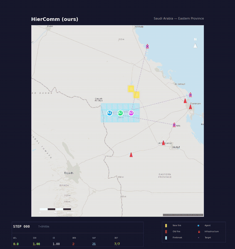
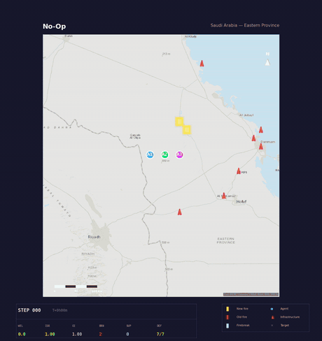
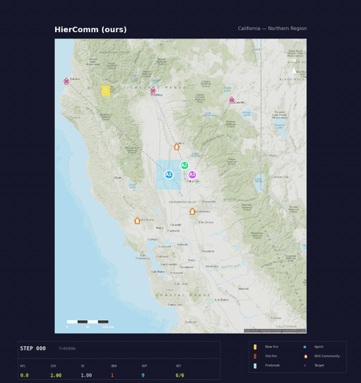
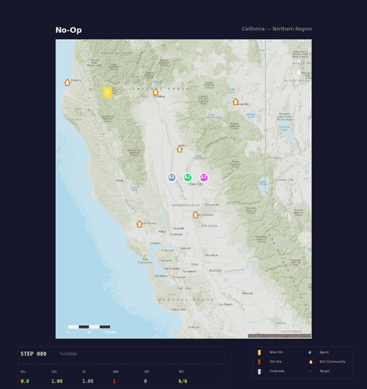

<div align="center">

# 🔥 wildfire-marl

**تعلّم معزّز هرمي متعدد الوكلاء لإخماد حرائق الغابات،<br/>مُقيَّم على فيزياء حرائق مُتحقَّق منها.**

[**English**](README.md) · [**العربية**](README.ar.md)

[](https://github.com/aliakarma/wildfire-rl/actions/workflows/ci.yml)
[](https://www.python.org/downloads/)
[](LICENSE)
[](https://github.com/psf/black)

[](third_party/README.md)
[](results/README.md)
[](docs/supplement_assets/REPRODUCIBILITY.md)
[](dashboard/README.md)

</div>

---

<div dir="rtl">

يدافع فريق من وكلاء الإطفاء عن البنية التحتية الحيوية ضد حريق ينتشر تحت محاكي **Cell2Fire** — وهو
محاكي مكتوب بلغة C++ ومُحكَّم علميًا، ينفّذ النظام الكندي للتنبؤ بسلوك حرائق الغابات (FBP). المشاهد
الأرضية حقيقية: موتّرات جغرافية مكانية من سبع قنوات (طقس ERA5، تضاريس SRTM، وقود NDVI من MODIS،
اشتعالات FIRMS) لمنطقتين مختلفتين تمامًا عن قصد — **المنطقة الشرقية في المملكة العربية السعودية**
(صحراء / منشآت نفطية) و**شمال كاليفورنيا** (غابات / تداخل بين العمران والغابات).

لا تُعدَّل فيزياء Cell2Fire إطلاقًا. جميع منطق الإخماد والتنسيق يقع في غلاف التعلّم المعزّز، لذا يبقى
نموذج الحريق كما نُشر تمامًا.

</div>

---

<div dir="rtl">

## 📋 المحتويات

- [🎬 شاهد المحاكاة](#-شاهد-المحاكاة)
- [🧭 نظرة عامة](#-نظرة-عامة)
- [📊 النتائج الرئيسية](#-النتائج-الرئيسية)
- [🧠 الطريقة: HierComm](#-الطريقة-hiercomm)
- [✅ المتطلبات](#-المتطلبات)
- [⚙️ التثبيت](#️-التثبيت)
- [🚀 البدء السريع](#-البدء-السريع)
- [🔬 إعادة إنتاج نتائج الورقة](#-إعادة-إنتاج-نتائج-الورقة)
- [🎛️ الإعدادات](#️-الإعدادات)
- [🗂️ بنية المستودع](#️-بنية-المستودع)
- [📈 لوحة النتائج](#-لوحة-النتائج)
- [🔒 ضمانات قابلية إعادة الإنتاج](#-ضمانات-قابلية-إعادة-الإنتاج)
- [🛠️ التطوير](#️-التطوير)
- [🩺 حل المشكلات](#-حل-المشكلات)
- [⚠️ القيود](#️-القيود)
- [📚 المصادر والتوثيق](#-المصادر-والتوثيق)
- [🤝 المساهمة](#-المساهمة)
- [📝 الاقتباس](#-الاقتباس)
- [⚖️ الترخيص](#️-الترخيص)

</div>

---

<div dir="rtl">

## 🎬 شاهد المحاكاة

حلقات مفردة محجوبة عن التدريب، مُصيَّرة من التسجيلات المجمّدة. على اليمين: **بدون تدخل**، وهو
الشاهد الذي لا يفعل شيئًا. على اليسار: **HierComm (طريقتنا)**. الأرقام التجميعية موجودة في
[النتائج الرئيسية](#-النتائج-الرئيسية) — هذه المقاطع توضيحية وليست قياسات.

</div>

<table>
<tr>
<th width="50%">🧯 HierComm (طريقتنا)</th>
<th width="50%">🚫 بدون تدخل</th>
</tr>
<tr>
<td></td>
<td></td>
</tr>
<tr>
<td colspan="2" align="center"><i>المملكة العربية السعودية — المنطقة الشرقية (صحراء / منشآت نفطية)</i></td>
</tr>
<tr>
<td></td>
<td></td>
</tr>
<tr>
<td colspan="2" align="center"><i>شمال كاليفورنيا (غابات / تداخل بين العمران والغابات)</i></td>
</tr>
</table>

<div dir="rtl">

> [!TIP]
> التسجيلات كاملة الدقة **لكل** سياسة ومنطقة — إضافةً إلى تسجيلات النقل بين المنطقتين — منشورة
> بصيغة MP4 في [`dashboard/public/media/`](dashboard/public/media/wildfire_phase5_gifs)، ويمكن
> تصفّحها تفاعليًا في [لوحة النتائج](#-لوحة-النتائج). تُعاد الوسائط بواسطة
> `scripts/render_phase5_gifs.py` و`scripts/render_phase6_transfer.py`.

</div>

---

<div dir="rtl">

## 🧭 نظرة عامة

إخماد الحرائق مسألة تنسيق: على فريق صغير أن يقرر *أي* الأصول يدافع عنها و*أين* يشق خطوط العزل،
تحت حريق لا يتحكم في انتشاره. يدرس هذا المستودع تلك المسألة بوصفها مهمة تعلّم معزّز تعاونية متعددة
الوكلاء فوق محاكي حرائق مُتحقَّق منه، بدلًا من نموذج حريق مُفصَّل يُضبَط بالتوازي مع السياسة.

### ما الذي يقدّمه هذا المستودع

| | |
|---|---|
| 🗺️ **معيار قياس** | منطقتان حقيقيتان مختلفتان، ونظام سيناريو قابل للإخماد، وبروتوكول تقييم بمسارات اشتعال منفصلة بين التدريب والتقييم. |
| 📐 **خطوط أساس** | أربع سياسات استرشادية متكافئة في المعلومات، وثلاث طرق متعلَّمة (MAPPO وCommNet وQMIX — والأخيرة تُبلَّغ كخط أساس فاشل). |
| 🧠 **طريقة مقترحة** | HierComm، سياسة من مستويين تجمع بين توزيع الأصول الواعي بالقيمة وطبقة تكتيكية متعلَّمة. انظر [الطريقة](#-الطريقة-hiercomm). |
| 🔒 **مخرجات مجمّدة** | كل رقم مُبلَّغ عنه مشتق من ملفات CSV لكل حلقة، مغطاة ببصمة SHA-256، ويمكن اشتقاقه من جديد خلال ثوانٍ بأمر واحد. |

### المقاييس

يحمل مقياسان النتائج الرئيسية. كلاهما مُعرَّف مرة واحدة في
[`src/wildfire_marl/eval/metrics.py`](src/wildfire_marl/eval/metrics.py)، وكل مستدعٍ يستخدم هذه
التعريفات.

| المقياس | الاتجاه | التعريف |
|---|:---:|---|
| **WEL** — الخسارة الاقتصادية الموزونة | 🔻 **الأقل أفضل** | مجموع `القيمة[نوع الأصل] × شدة الحريق النهائية` على خلايا الأصول. |
| **ISR** — معدل بقاء البنية التحتية | 🔺 **الأعلى أفضل** | نسبة خلايا الأصول التي لم يصل إليها الحريق (شدة نهائية ≤ `REACH_THRESHOLD`، أي 0.1). |

> [!NOTE]
> **‏WEL مؤشر بلا وحدات، وليس مبلغًا نقديًا.** قيم الأصول مضاعِفات نسبية مُبسَّطة (افتراضيًا
> `{1: 10.0, 2: 4.0, 3: 6.0, 4: 3.0}`)، وخريطة الأهمية الأساسية هي تدرّج غاوسي في المجال `[0, 1]`
> حول مواقع بنية تحتية عامة — وليست تقييمات اقتصادية مقيسة. يصلح WEL للمقارنة *بين السياسات على
> المشهد الأرضي نفسه*، وليس كمية نقدية. انظر [`docs/data_card.md`](docs/data_card.md).

مقاييس إضافية (كفاءة التنسيق، ومنع الكوارث، والاحتواء المعدَّل بالمخاطر، ودرجة الاحتفاظ بعد النقل)
مُعرَّفة في الوحدة نفسها ومُبلَّغ عنها في المخرجات المجمّدة.

</div>

---

<div dir="rtl">

## 📊 النتائج الرئيسية

سبع سياسات، ومنطقتان، وخمس بذور تدريب، مُقيَّمة على بذور اشتعال محجوبة (15 حلقة لكل مجموعة بذور).
السياسات الاسترشادية حتمية، لذا لا تحمل تباينًا بين البذور.

| السياسة | WEL السعودية 🔻 | ISR السعودية 🔺 | WEL كاليفورنيا 🔻 | ISR كاليفورنيا 🔺 |
|---|---|---|---|---|
| بدون تدخل | 27.00 | 0.286 | 34.00 | 0.000 |
| الأولوية للقيمة | 18.84 | 0.545 | 28.40 | 0.156 |
| الأشد خطورةً أولًا | 24.72 | 0.358 | 28.40 | 0.156 |
| التفاعلي المحلي | 11.91 | 0.720 | 10.23 | 0.702 |
| التعلم المسطّح متعدد الوكلاء (MAPPO) | 9.77 ± 5.10 | 0.692 | 14.17 ± 2.89 | 0.624 |
| CommNet | 12.44 ± 4.32 | 0.682 | 19.58 ± 7.77 | 0.398 |
| 🏆 **‏HierComm (طريقتنا)** | **7.02 ± 2.36** | **0.809** | **5.88 ± 1.04** | **0.832** |

‏HierComm هي الأفضل في المنطقتين، وهي الأكثر *موثوقية* بفارق واضح — إذ تملك أدنى تباين بين البذور
بين كل الطرق المتعلَّمة. في كاليفورنيا الفارق حاسم إحصائيًا (مقابل MAPPO: ‏p = 0.0018 و‏d = −3.81).
وفي السعودية تتفوق على كل خط أساس عدا MAPPO، التي تتعادل معها في المتوسط (‏p = 0.32، غير دال) مع
حساسية أقل بكثير تجاه البذرة.

### تحليل إزالة المكوّنات: ما تقوله البيانات فعلًا

لا تدعم تحليلات إزالة المكوّنات المفردة الرواية الحدسية، وهي مُبلَّغة كما قيست (السعودية؛ خمس بذور
تدريب ما لم يُذكر خلاف ذلك).

| المكوّن المُزال | WEL السعودية 🔻 | مقابل النظام الكامل |
|---|---|---|
| — (النظام الكامل) | 7.02 ± 2.36 | — |
| التواصل | 5.67 ± 1.16 | ‏p = 0.30 · ⚪ **غير دال** |
| تشكيل المكافأة التكتيكية | 5.41 ± 1.43 | ‏p = 0.23 · ⚪ **غير دال** |
| الهرمية | 12.44 ± 4.32 | ‏p = 0.048 · 🔴 أسوأ بدلالة إحصائية |
| الضبط الدقيق بالتعلّم المعزّز (استنساخ سلوكي فقط) | 11.33 ± 1.26 | ‏p = 0.011 · 🔴 أسوأ بدلالة إحصائية |
| الطبقة التكتيكية المتعلَّمة <sup>†</sup> | 18.76 | 🔴 تدهور كبير |

<sup>†</sup> بذرة واحدة (المتغيّر حتمي)، لذا لا يُبلَّغ عن اختبار دلالة.

إزالة التواصل أو تشكيل المكافأة *تخفض* WEL قليلًا، لكن أيًّا من التغييرين ليس دالًا إحصائيًا.
**التواصل بين الوكلاء ليس هو المحرّك عند مقياس الوكلاء الثلاثة المدروس.** المحرّكات هي الهرمية،
والطبقة التكتيكية المتعلَّمة، والضبط الدقيق بالتعلّم المعزّز. كذلك فإن قائدًا *متعلَّمًا* دُرِّب على حدة
لا يتفوق أبدًا بدلالة إحصائية على قاعدة التوزيع الواعية بالقيمة، ولهذا يحتفظ النظام المنشور بالقاعدة.

البروتوكول الكامل واختبارات الدلالة وتحفظات إعادة الإنتاج الموثَّقة:
[`docs/RESULTS_FROZEN.md`](docs/RESULTS_FROZEN.md).

</div>

---

<div dir="rtl">

## 🧠 الطريقة: HierComm

‏HierComm سياسة تعاونية من مستويين على `N` وكيلًا (افتراضيًا `N = 3`)، مُنفَّذة في
[`src/wildfire_marl/train/hier_comm_train.py`](src/wildfire_marl/train/hier_comm_train.py).

**1. القائد الاستراتيجي.** كل `macro_interval` خطوة، يسند إلى كل وكيل أصلًا *مهددًا* عالي القيمة
للدفاع عنه. وله وضعان:

- `heuristic` — قاعدة توزيع واعية بالقيمة. **وهذا هو التكوين المُبلَّغ عنه باسم "‏HierComm (طريقتنا)"**
  (معرّف الطريقة `hiercomm_heur`)؛ وهو يعزل مساهمة التعلّم التكتيكي.
- `learned` — شبكة [`StrategicController`](src/wildfire_marl/agents/strategic_controller.py)،
  تُهيَّأ بالاستنساخ السلوكي ثم تُحدَّث بخوارزمية REINFORCE مع مرساة KL إلى التوزيع الأولي. تُقيَّم
  كتحليل إزالة مكوّن ولا تتفوق أبدًا بدلالة إحصائية على القاعدة.

**2. الفاعل التكتيكي.** سياسة متعلَّمة ومتواصلة تدافع عن الأصل المُسند، مشروطةً بهدف الأصل وبرسائل
مجمّعة بالمتوسط من بقية الفريق. تُدرَّب على مرحلتين:

- **تهيئة بالاستنساخ السلوكي** — استنساخ الدفاع عن الأصول الواعي بالقيمة، وهو أصلًا يخفض WEL إلى ما
  دون خط الأساس التفاعلي المحلي غير الواعي بالقيمة.
- **الضبط الدقيق بـ PPO** — تحسين هدف WEL/ISR مباشرةً (مطابق للتقييم) بناقد مركزي وتشكيل خفيف
  لخطوط العزل.

المعاملات مشتركة بين الوكلاء، لذا فالسياسة غير مقيَّدة بعدد الوكلاء.

</div>

---

<div dir="rtl">

## ✅ المتطلبات

تختلف المتطلبات اختلافًا كبيرًا بحسب سير العمل. **المحاكي وحده هو المقيَّد بنظام Linux.**

| سير العمل | نظام التشغيل | Python | متطلبات إضافية |
|---|---|:---:|---|
| 🔍 التحقق من الأرقام المنشورة | Linux · macOS · Windows | 3.10 / 3.11 | لا شيء غير الاعتماديات الأساسية |
| 🧪 تشغيل مجموعة الاختبارات | Linux · macOS · Windows | 3.10 / 3.11 | الإضافة `[dev]` |
| 🔥 تشغيل المحاكي | **‏Linux فقط** (WSL2، أو أصلي، أو Colab) | 3.10 / 3.11 | ‏`g++`، ترويسات Boost، Eigen3 |
| 🏋️ التدريب أو إعادة إنتاج التجارب | **‏Linux فقط** | 3.10 / 3.11 | محاكي مبني + PyTorch |
| 📈 بناء لوحة النتائج | Linux · macOS · Windows | 3.10 / 3.11 | ‏Node.js 22 (مثبَّت في CI) |

> [!IMPORTANT]
> ‏Cell2Fire بناء بلغة C++ و**نظام Windows الأصلي غير مدعوم للمحاكي**. استخدم WSL2 أو جهاز Linux أو
> Colab لأي عمل يشغّل البيئة. أما التحقق ومجموعة الاختبارات وبناء اللوحة فتعمل على Windows وmacOS
> أيضًا — والاختبارات التي تشغّل الملف التنفيذي المُصرَّف تُتجاوَز تلقائيًا.

</div>

---

<div dir="rtl">

## ⚙️ التثبيت

### 1. الاستنساخ

</div>

```bash
git clone https://github.com/aliakarma/wildfire-rl.git
cd wildfire-rl
```

<div dir="rtl">

نسخة Cell2Fire المتفرعة مضمَّنة كملفات عادية لا كوحدة git فرعية، لذا لا حاجة إلى `--recursive` ولا
إلى تهيئة وحدات فرعية.

### 2. بيئة Python

يُنصح بـ conda على Linux لأنها توفّر سلسلة أدوات C++ وحزمة GDAL الثنائية في خطوة واحدة:

</div>

```bash
conda env create -f environment-linux.yml
conda activate wildfire-marl
```

<div dir="rtl">

ويعمل pip العادي على أي نظام تشغيل لسير عمل التحقق والاختبارات واللوحة:

</div>

```bash
pip install -e ".[dev]"
```

<div dir="rtl">

> [!IMPORTANT]
> الإضافة `[dev]` **لا** تتضمن PyTorch. كل مشغّلات التدريب والتقييم (`run_phase3.py` و
> `run_phase4_ablations.py` و`run_phase6_transfer.py`) تستورد `torch` عند تحميل الوحدة، لذا ثبّته
> قبل [إعادة إنتاج نتائج الورقة](#-إعادة-إنتاج-نتائج-الورقة):
>
> ```bash
> pip install -e ".[dev]" "torch>=2.1,<3.0"
> ```
>
> أما الإضافة الاختيارية `[baselines]` فتضيف Stable-Baselines3 و sb3-contrib، ولا يستخدمها سوى خط
> أساس Maskable-PPO أحادي الوكيل في
> [`agents/ppo_baseline.py`](src/wildfire_marl/agents/ppo_baseline.py).

### 3. بناء محاكي الحريق (على Linux فقط)

مطلوب فقط لتشغيل البيئة. تجاوزه إن كنت تتحقق من الأرقام المنشورة.

</div>

```bash
sudo apt-get update
sudo apt-get install -y build-essential libboost-all-dev libeigen3-dev

cd third_party/firehose/cell2fire/Cell2FireC
make
```

<div dir="rtl">

ينتج عن ذلك الملف التنفيذي `Cell2Fire` في المجلد نفسه، وهو بالضبط حيث يتوقعه
[`env/cell2fire_binding.py`](src/wildfire_marl/env/cell2fire_binding.py). التعليمات الكاملة وحل
المشكلات: [`docs/supplement_assets/BUILD.md`](docs/supplement_assets/BUILD.md).

للتأكد من أن الملف التنفيذي قابل للاكتشاف:

</div>

```bash
python -c "from wildfire_marl.env.cell2fire_binding import DEFAULT_BINARY; print('binary present:', DEFAULT_BINARY.exists())"
```

<div dir="rtl">

### 4. اختياري — بيانات اعتماد جلب البيانات

مطلوبة فقط لإعادة تشغيل دفاتر جلب البيانات الجغرافية المكانية في `notebooks/`. أما مشاهد Cell2Fire
المولَّدة فهي مُودعة أصلًا في المستودع، لذا لا تحتاج إليها التجارب.

</div>

```bash
cp .env.example .env   # ثم املأ CDSAPI_KEY و FIRMS_MAP_KEY و EE_PROJECT_ID
```

<div dir="rtl">

الملف `.env` مستثنى من git. لا تودع بيانات اعتماد حقيقية أبدًا.

</div>

---

<div dir="rtl">

## 🚀 البدء السريع

### 🔍 التحقق من الأرقام المنشورة — ثوانٍ، بلا معالج رسومات، وبلا بناء المحاكي

هذه أسرع طريقة لتدقيق المستودع. تعيد حساب الجدول الرئيسي واختبارات الدلالة ومصفوفة النقل ومسح
الصعوبة مباشرةً من ملفات CSV المودعة لكل حلقة، وتتحقق من كل ملف مقابل بصمته المجمّدة SHA-256.

</div>

```bash
python scripts/verify_supplement.py
```

<div dir="rtl">

السطور الأخيرة المتوقعة:

</div>

```text
42 passed, 0 failed, 0 skipped
VERIFICATION PASSED — every claim checked re-derives from the frozen artifacts.
```

<div dir="rtl">

رمز الخروج يكون 0 فقط إذا نجح كل فحص.

### 🧪 تشغيل مجموعة الاختبارات

</div>

```bash
pytest tests/
```

<div dir="rtl">

المتوقع دون بناء المحاكي: **نجاح 61 وتجاوز 7**. الاختبارات السبعة المتجاوَزة هي التي تشغّل الملف
التنفيذي المُصرَّف؛ وتعمل بعد إتمام البناء.

### 🐍 استخدام المقاييس مباشرةً

مثال بسيط قابل للتشغيل — بلا محاكي، وبلا معالج رسومات، وبلا PyTorch:

</div>

```python
import numpy as np
from wildfire_marl.eval.metrics import (
    infrastructure_survival_rate,
    weighted_economic_loss,
)

# مشهد 4x4 توضيحي: رموز الأصول (0 = لا يوجد أصل) وشدة الحريق النهائية.
asset_type = np.array([[1, 0, 0, 0],
                       [0, 0, 0, 0],
                       [0, 0, 2, 0],
                       [0, 0, 0, 0]])
final_fire = np.zeros((4, 4))
final_fire[0, 0] = 0.9          # وصل الحريق إلى الأصل من النوع 1
asset_values = {1: 10.0, 2: 4.0}

print("WEL:", weighted_economic_loss(asset_type, final_fire, asset_values))
print("ISR:", infrastructure_survival_rate(asset_type, final_fire))
```

```text
WEL: 9.0
ISR: 0.5
```

<div dir="rtl">

### 🔥 تشغيل المحاكي — على Linux، بعد البناء

</div>

```bash
python scripts/sim_smoke.py --region saudi        # أو: --region california
python scripts/profile_env.py                     # إنتاجية الخطوة وإعادة التهيئة
```

<div dir="rtl">

يشغّل `sim_smoke.py` حريقًا حرًّا على مشهد المنطقة ويتحقق من أن الفيزياء *معقولة* لا مجرد قابلة
للتشغيل: نمو مطّرد للحريق، وانحراف الانتشار مع اتجاه الريح مقارنًا بمتوسط اتجاه ريح الطقس، وانطفاء
ذاتي في المناطق شحيحة الوقود.

</div>

---

<div dir="rtl">

## 🔬 إعادة إنتاج نتائج الورقة

> [!WARNING]
> **نقاط التحقق غير متتبَّعة في git** — فهي تُشحن مع الملحق. والمشغّلات متكافئة التنفيذ وستقوم
> **بتدريب** أي نقطة تحقق لا تجدها، لذا فإن مجلد نقاط تحقق ناقصًا يحوّل تقييمًا مدته دقائق إلى مهمة
> تدريب تستغرق ساعات دون تنبيه. تأكد أولًا من وجود نقاط التحقق في
> `results/wildfire_phase3_multiseed/`، أو قيّد التشغيل على البذور المتوفرة لديك فعلًا.

### مستويات إعادة الإنتاج

مرتبة حسب التكلفة. يربط [`docs/supplement_assets/REPRODUCIBILITY.md`](docs/supplement_assets/REPRODUCIBILITY.md)
كل ادعاء بأمره وبالرقم المتوقع منه.

| المستوى | ما يفعله | التكلفة | يحتاج المحاكي؟ |
|:---:|---|---|:---:|
| 1️⃣ | إعادة اشتقاق كل رقم مُبلَّغ من ملفات CSV المجمّدة | ثوانٍ | ❌ |
| 2️⃣ | تشغيل مجموعة الاختبارات | ثوانٍ | ❌ |
| 3️⃣ | إعادة تقييم نقطة تحقق مشحونة مقابل المحاكي الحقيقي | 10–30 دقيقة | ✅ |
| 4️⃣ | إعادة التدريب الكامل من الصفر | ساعات معالج رسومات | ✅ |

### أوامر التجارب الكاملة

مع وجود نقاط التحقق في `results/wildfire_phase3_multiseed/`، تُعاد كل دراسة من سطر الأوامر:

</div>

```bash
# النتائج الرئيسية — تدريب 7 سياسات × منطقتين × 5 بذور، ثم التقييم على بذور محجوبة.
python scripts/run_phase3.py \
  --methods noop,value_first,greedy_risk,local_reactive,mappo,commnet,hiercomm_heur \
  --regions saudi,california --train-seeds 42,1042,2042,3042,4042 --parallel 6 \
  --train-steps 100000 --episodes 15 --out results/wildfire_phase3_multiseed

# تحليلات إزالة المكوّنات ومسح الصعوبة.
python scripts/run_phase4_ablations.py --study ablation \
  --ckpt-dir results/wildfire_phase3_multiseed --out /tmp/ablations

# مصفوفة النقل بين السعودية وكاليفورنيا والتعميم على حالات محجوبة.
python scripts/run_phase6_transfer.py \
  --ckpt-dir results/wildfire_phase3_multiseed --out /tmp/transfer
```

<div dir="rtl">

أضف `--quick` إلى أي من الثلاثة لتشغيل تحقق سريع من طرف إلى طرف قبل الالتزام بمسح كامل.

### الحتمية وبروتوكول البذور

الحتمية مفروضة من طرف إلى طرف: بذور إعادة تهيئة التدريب هي `seed·100000 + episode`، وبذور إعادة
تهيئة التقييم هي `group + 100000 + episode`، لذا فالمساران منفصلان بحكم البناء ولا تُرى أي اشتعالة
تقييم أثناء التدريب. وقد ثبت أن خط أنابيب البذور متطابق بتًّا ببتّ على وحدة المعالجة المركزية.

يوجد استثناء واحد موثَّق (في سياسة "الأشد خطورةً أولًا" فقط، محصور في مساراتها المعرَّضة للتصادم، ولا
يؤثر في أي ترتيب أو استنتاج) — انظر ملاحظة إعادة الإنتاج في
[`docs/RESULTS_FROZEN.md`](docs/RESULTS_FROZEN.md).

</div>

---

<div dir="rtl">

## 🎛️ الإعدادات

تُختار ظروف السيناريو عبر **نظام** مُسمّى، مُعرَّف مرة واحدة في
[`src/wildfire_marl/env/regimes.py`](src/wildfire_marl/env/regimes.py):

| النظام | الطقس (مقابل ERA5) | الخطوة (دقائق محاكاة) | الاشتعال | خط العزل | الغرض |
|---|---|:---:|---|:---:|---|
| `legacy` | متطرف (دون تعديل) | 60 | منتظم | لا يوجد | إعادة إنتاج النتائج الأصلية غير القابلة للإخماد |
| `default` | معتدل | 30 | مُوجَّه (أعلى الريح من الأصول) | 3×3 | **المعيار الرئيسي** (مطابق لـ `medium`) |
| `easy` / `medium` / `hard` | شدة متزايدة | 20 / 30 / 40 | مُوجَّه | 3×3 | محور الصعوبة لدراسة المتانة |

تُبنى البيئات عبر مصنع واحد بحيث تشترك كل الطرق في تعريف بيئة واحد:

</div>

```python
from wildfire_marl.env.regimes import make_marl_env

env = make_marl_env("saudi", regime="default", num_agents=3)
```

<div dir="rtl">

تتغلب الوسائط المُسمّاة على افتراضات النظام. وملفات إعداد التدريب بصيغة YAML في `configs/marl/` تختار
منطقة ونظامًا وتضبط ميزانية التعلّم؛ وهي لا تعيد تعريف مقابض الفيزياء. انظر
[`configs/marl/regimes/README.md`](configs/marl/regimes/README.md).

> [!NOTE]
> **لا تُعدَّل فيزياء انتشار Cell2Fire (FBP) إطلاقًا** — يتغير فقط مدخلات طقس السيناريو، وموضع
> الاشتعال، وبصمة خط العزل في الغلاف.

</div>

---

<div dir="rtl">

## 🗂️ بنية المستودع

</div>

```text
src/wildfire_marl/        المكتبة
  env/                    ربط Cell2Fire، بيئات Gymnasium و PettingZoo، الأنظمة، المكافآت
  agents/                 سياسات استرشادية متكافئة في المعلومات، خط أساس PPO، شبكات التواصل والاستراتيجية
  train/                  حلقات تدريب MAPPO / QMIX / CommNet / HierComm
  eval/                   المقاييس، اختبارات الدلالة، النقل، بروتوكول التقييم
  data/                   موتّرات المناطق -> مشاهد Cell2Fire؛ ترتيب القنوات المجمّد
  infra/                  خرائط البنية التحتية الحيوية ونموذج التتابع
  viz/                    تصيير التسجيلات والمقارنات والنقل
  reproducibility/        البذور، البصمات، حراسة السلامة

scripts/                  21 مشغّل تجارب (run_phase3/4/6، التجميد، التصيير، البناء، التحقق)
configs/                  إعدادات التجارب والأنظمة بصيغة YAML
tests/                    مجموعة اختبارات pytest
notebooks/                دفاتر جلب البيانات الجغرافية لكل مصدر (ERA5/FIRMS/DEM/NDVI)
results/                  مخرجات مجمّدة مبصومة — انظر results/README.md
dashboard/                لوحة نتائج React مبنية من المخرجات المجمّدة
data/                     مشاهد Cell2Fire + موتّر عينة مودع (الخرائط النقطية مستثناة من git)
docs/                     بطاقة البيانات، بطاقة البنية التحتية، النتائج المجمّدة، الترحيل، سجل المراجعات
docs/media/               صور GIF المستخدمة في هذا الملف
third_party/firehose/     نسخة Firehose المتفرعة من Cell2Fire (GPL-3.0)
```

<div dir="rtl">

وسائط التسجيلات كاملة الدقة (GIF/MP4) تُكتب في `figures/` وهي **غير متتبَّعة** — تُعاد بواسطة
`scripts/render_phase5_gifs.py` و`scripts/render_phase6_transfer.py`، والنسخ المضغوطة للويب التي
تُشحن فعليًا موجودة في `dashboard/public/media/`.

</div>

---

<div dir="rtl">

## 📈 لوحة النتائج

المجلد `dashboard/` موقع React ثابت وثنائي اللغة (إنجليزي / عربي بدعم كامل للاتجاه من اليمين إلى
اليسار) ومُنسَّق بسمات. **كل رقم يعرضه مولَّد وقت البناء من المخرجات المجمّدة — لا شيء مكتوب يدويًا.**
تعيد عملية البناء حساب بصمة كل مجلد مجمّد وتتوقف عند أي عدم تطابق.

</div>

```bash
python scripts/build_dashboard_data.py --copy-media   # المخرجات المجمّدة -> JSON اللوحة
python scripts/check_dashboard_consistency.py         # بوابة تطابق أرقام الورقة واللوحة
cd dashboard && npm ci && npm run dev
```

<div dir="rtl">

أضف `--release` إلى فحص التطابق ليشترط إضافةً إلى ذلك وجود كل ملف وسائط وكل تسجيل مُشار إليه على
القرص — وهو إلزامي قبل النشر.

> [!TIP]
> 📖 **الملف [`dashboard/README.md`](dashboard/README.md) هو دليل اللوحة الكامل.** يغطي سير العمل
> كاملًا (إعادة توليد البيانات، وبوابات الإصدار، والتطوير والاختبار والبناء)، وما هو مودع مقابل ما هو
> مولَّد، وقرارات التصميم الموثَّقة، والخطوات المقيَّدة بـ WSL للمخرجات المدعومة بالمحاكاة (تسجيلات
> المستوى الثاني التفاعلية وضغط MP4)، وبوابة المراجعة العربية بواسطة متحدث أصلي، وقائمة تحقق
> الإصدار. اقرأه قبل تغيير أي شيء داخل `dashboard/`.

</div>

---

<div dir="rtl">

## 🔒 ضمانات قابلية إعادة الإنتاج

يحمل كل مجلد تحت `results/` ملف `MANIFEST.sha256` (بصمة لكل ملف) وملف `FREEZE.json` (بصمة واحدة على
ذلك البيان)، بحيث يكون أي تغيير في رقم مُبلَّغ قابلًا للكشف. وتُحسب البصمات على مسارات نسبية لكل
مجلد، لذا تتحقق المخرجات بالطريقة نفسها أينما استُنسخت الشجرة.

يفرض التكامل المستمر (CI) في كل دفع:

- ✅ حتمية خط أنابيب البذور وصحة موتّر العينة المودع؛
- ✅ سلامة البذور عبر نقاط التحقق والبيانات وملفات CSV التقييمية المسجّلة؛
- ✅ أن JSON اللوحة ما زال مطابقًا للملخصات المجمّدة ولقيم الورقة معًا؛
- ✅ إمكانية الوصول (axe-core على كل مسار × لغة × سمة) وميزانيات Lighthouse؛
- ✅ الفحص (ruff) والتنسيق (black) والاختبارات على Python 3.10 و3.11 وفحص تثبيت نظيف؛
- ✅ ألا يتجاوز أي ملف متتبَّع 50 ميغابايت.

انظر [`results/README.md`](results/README.md) لجدول البصمات لكل مجلد.

</div>

---

<div dir="rtl">

## 🛠️ التطوير

### الفحوصات المحلية

تعكس هذه الأوامر ما يشغّله CI:

</div>

```bash
ruff check src tests scripts        # الفحص
black --check src tests scripts     # التنسيق
mypy                                # فحص الأنواع (الإعداد في pyproject.toml)
pytest -q                           # الاختبارات
```

<div dir="rtl">

ثبّت خطاطيف pre-commit مرة واحدة؛ فتعمل بعدها ruff وblack و`nbstripout` وحارس الملفات الكبيرة عند
كل إيداع:

</div>

```bash
pre-commit install
```

<div dir="rtl">

### بوابات السلامة

</div>

```bash
python -m wildfire_marl.reproducibility.validate_tensors      # صحة الموتّر المودع
python -m wildfire_marl.reproducibility.check_seed_integrity  # سلامة البذور والبيانات
python scripts/check_dashboard_consistency.py                 # تطابق أرقام الورقة واللوحة
```

<div dir="rtl">

### الاختبارات

</div>

```bash
pytest tests/                       # المجموعة الكاملة
pytest -m "not slow"                # تجاوز الاختبارات البطيئة
pytest --cov=wildfire_marl          # مع تغطية الشيفرة
```

<div dir="rtl">

العلامات مُعرَّفة في `pyproject.toml`: `slow` و`integration` (اختبارات من طرف إلى طرف تتطلب
اعتماديات اختيارية).

</div>

---

<div dir="rtl">

## 🩺 حل المشكلات

| العَرَض | السبب | الحل |
|---|---|---|
| `ModuleNotFoundError: No module named 'torch'` | الإضافة `[dev]` لا تتضمن PyTorch | `pip install "torch>=2.1,<3.0"` |
| `sim_smoke.py: error: the following arguments are required: --region` | الوسيط `--region` إلزامي | `python scripts/sim_smoke.py --region saudi` |
| تجاوز 7 اختبارات | الملف التنفيذي Cell2Fire غير مبني — وهذا متوقع | ابنِ المحاكي، أو تجاهل الأمر إن كنت تتحقق فقط |
| تجاوز اختبارات على Windows | المحاكي مقيَّد بـ Linux | استخدم WSL2 أو Linux أو Colab لعمل المحاكي |
| التقييم يبدأ عملية تدريب طويلة | نقاط التحقق مفقودة؛ والمشغّلات تدرّب ما لا تجده | استعد نقاط التحقق، أو قيّد `--train-seeds` |
| بناء اللوحة يتوقف عند عدم تطابق البصمة | تغيّر مخرَج مجمّد | هذا مقصود — حقّق في التغيير ولا تتجاوز الفحص |
| `No dashboard data at ... — run scripts/build_dashboard_data.py` | فحص التطابق سبق البناء | شغّل `build_dashboard_data.py` أولًا |

</div>

---

<div dir="rtl">

## ⚠️ القيود

مذكورة صراحةً، وموثَّقة بالتفصيل في [`docs/data_card.md`](docs/data_card.md):

- **للاستخدام البحثي فقط.** غير مخصص لقرارات إطفاء تشغيلية.
- **شهر واحد ومنطقتان.** التغطية الزمنية هي يونيو 2025 — وهو قيد موثَّق يتعلق بالموسمية.
- **فيزياء مبسّطة.** بلا كيمياء احتراق، ولا انتقال جمرات، ولا اقتران بالغلاف الجوي.
- **قيم أصول مُبسَّطة.** الأهمية تدرّج غاوسي حول مواقع بنية تحتية عامة، لا تقييمات اقتصادية مقيسة.
- **حساسية معلنة لخريطة الوقود.** عتبات تحويل NDVI إلى أصناف FBP اجتهاد خبراء ومعلَنة كمعامل
  حساسية؛ وقيم NDVI لكاليفورنيا مُعاد بناؤها وفق افتراض موثَّق (دَين بيانات مُسجَّل).
- **تطبيع لكل منطقة على حدة.** التطبيع min-max يجري لكل منطقة، لذا يتطلب النقل بين المنطقتين
  مقياسًا مشتركًا.
- **مقياس ثلاثة وكلاء.** نتيجة انعدام أثر التواصل مثبتة عند `N = 3`.

</div>

---

<div dir="rtl">

## 📚 المصادر والتوثيق

| | |
|---|---|
| 🧊 النتائج المجمّدة والبروتوكول والتحفظات | [`docs/RESULTS_FROZEN.md`](docs/RESULTS_FROZEN.md) |
| 🗺️ مصادر البيانات والتراخيص ونظام الإحداثيات والتطبيع | [`docs/data_card.md`](docs/data_card.md) |
| 🏭 طبقة البنية التحتية الحيوية | [`docs/infra_card.md`](docs/infra_card.md) |
| 🔁 إعادة التأسيس من V1 إلى V2 على Cell2Fire | [`docs/MIGRATION.md`](docs/MIGRATION.md) |
| 🔍 التدقيق المستقل وسجل المراجعات | [`docs/reviews/`](docs/reviews/) |
| 📦 الادعاء ← الأمر ← الرقم المتوقع | [`docs/supplement_assets/REPRODUCIBILITY.md`](docs/supplement_assets/REPRODUCIBILITY.md) |
| ⚗️ مصدر المحاكي المضمَّن | [`third_party/README.md`](third_party/README.md) |
| 📜 سجل الإصدارات | [`CHANGELOG.md`](CHANGELOG.md) |

</div>

---

<div dir="rtl">

## 🤝 المساهمة

المساهمات مرحَّب بها. انظر [`CONTRIBUTING.md`](CONTRIBUTING.md) لسير العمل والمعايير، و
[`CODE_OF_CONDUCT.md`](CODE_OF_CONDUCT.md) لتوقعات المجتمع.

المعايير الأساسية المفروضة هنا: مصدر واحد للحقيقة لكل شأن (بيئة واحدة، ووحدة مقاييس واحدة)، وبلا
مسارات مثبَّتة أو أرقام سحرية، وحتمية عبر مولّد الأرقام العشوائية المبذور في البيئة لا عبر
`np.random` العام، وبلا ملفات ثنائية كبيرة في git.

</div>

---

<div dir="rtl">

## 📝 الاقتباس

إذا استخدمت هذا البرنامج، يُرجى الاقتباس على النحو التالي:

</div>

```bibtex
@software{akarma_wildfire_marl,
  author  = {Akarma, Ali},
  title   = {wildfire-marl: Hierarchical Multi-Agent Reinforcement Learning
             for Wildfire Suppression on Validated Fire Physics},
  url     = {https://github.com/aliakarma/wildfire-rl},
  version = {2.0.0a0}
}
```

<div dir="rtl">

انظر [`CITATION.cff`](CITATION.cff) للسجل المقروء آليًا.

### اقتباس المحاكيات الأساسية

يبني هذا العمل مباشرةً على نظامين سابقين، وينبغي اقتباسهما إلى جانبه:

- **‏Cell2Fire** (‏Pais وآخرون) — محاكي نمو الحرائق الخلوي المُحكَّم علميًا، والمنفِّذ للنظام الكندي FBP.
- **‏Firehose** (‏Shen وCurtis وآخرون، 2022) — النسخة المتفرعة من Cell2Fire التي توفّر بروتوكول
  الخطوة التفاعلي عبر stdin/stdout الذي تُبنى عليه هذه البيئة.

المصدر، والالتزام الدقيق للنسخة المتفرعة، وفرق سلامة الفيزياء مقابل Cell2Fire الأصلي، كلها مسجّلة في
[`third_party/README.md`](third_party/README.md) و
[`third_party/firehose/VENDORED.md`](third_party/firehose/VENDORED.md).

</div>

---

<div dir="rtl">

## ⚖️ الترخيص

رخصة MIT لشيفرة هذا المستودع — انظر [`LICENSE`](LICENSE).

أما المحاكي المضمَّن في `third_party/firehose/` فهو نسخة **Firehose** المتفرعة من Cell2Fire،
المرخّصة بـ **GPL-3.0**. وهو يحتفظ برخصته الخاصة ويُعاد توزيعه دون تعديل مقارنةً بالتزام المنبع؛
وفيزياء الحريق فيه مطابقة بتًّا ببتّ لـ Cell2Fire، مع اقتصار التغييرات على التحكم في حلقة التفاعل
وكتم سجلات التنقيح.

</div>

---

<div dir="rtl">

> [!NOTE]
> **حول هذه الترجمة.** تتبع المصطلحات التقنية هنا مسرد المراجعة العربية المعتمد في
> [`docs/ar_copy_review.md`](docs/ar_copy_review.md)، وهو المسرد نفسه المستخدم في لوحة النتائج،
> لضمان الاتساق. تخضع النسخة العربية لبوابة مراجعة من متحدث أصلي كما هو موضّح في دليل اللوحة؛
> النسخة الإنجليزية في [`README.md`](README.md) هي المرجع عند أي اختلاف.

</div>
